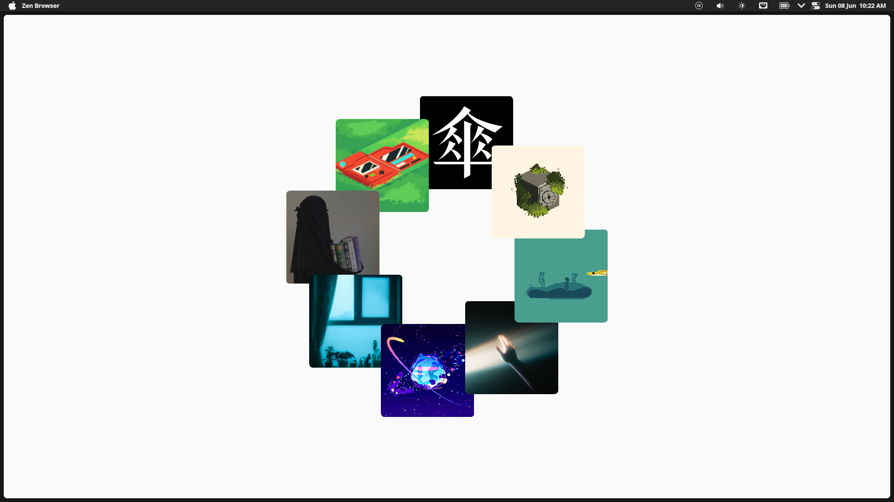

# 🌀 Gravity Orbit – CSS-Only Rotating Gallery

A minimalist, physics-inspired, rotating image gallery built with pure HTML and CSS.  
Each image appears suspended, gently rotating as if pinned in space — no JavaScript, just elegant motion.

## 🌟 Features

- 🔄 CSS-only rotation
- 🧲 Fake-physics animation (pendulum-like pin effect)
- 💡 Lightweight and fast
- 📱 Responsive and clean design
- 🎨 Aesthetic, modern, and minimalist

## 📸 Preview



## 📂 How to Use

1. Clone the repo:
   ```bash
   git clone https://github.com/asianprogrammer/Rotate.git Rotate
   cd Rotate